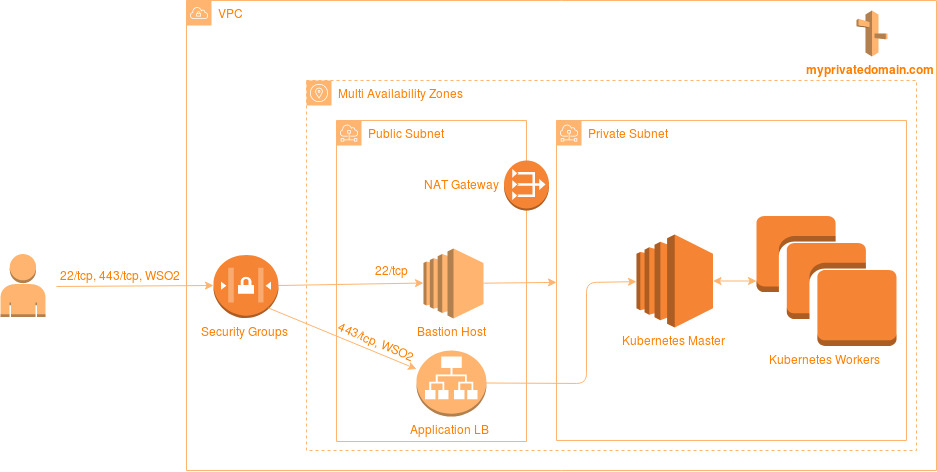

# terraform-kubernetes-demo

the simple terraform module set to create kubernetes cluster. could be used for demo, dev, test environments

## Modules Overview

* `aws-demo` a demo module that uses others
* `aws-kub`  a module to create simple kubernetes cluster based on amazon virtual machines
* `aws-listener` exposes public port
* `certificates` initializes demo certificates
* `kub-component-java-base` creates a kubernetes deployment and service for a java-based project
* `persistent-nfs` a simple deployment of artifacts through ssh 


## Infrastructure Overview  



**NOTE:** the following instruction works under linux and windows

### 0. Prerequisites 

**Create AWS iam user/group with the following permissions:**
1. AmazonEC2FullAccess
2. AmazonVPCFullAccess 
3. AmazonRoute53FullAccess
4. AmazonElasticFileSystemFullAccess
5. AmazonS3FullAccess

**Download terraform**
https://www.terraform.io/downloads.html

The terraform configs created for the version 0.11.x

### 1. Generate your deployer key pair:  
go into the project root directory and generate the deployer-key and public ssh cert

or put into your home `~/.ssh` folder your key and public part for it

```shell
ssh-keygen -t rsa -f ~/.ssh/deployer-key
```

This key you could use to connect bastion server 

### 2. Define AWS credentials
Create file `1.auto.tfvars` in your root module (you can use `aws-demo`) with following content:
```shell
aws_access_key = "Here put your access_key"
aws_secret_key = "Here put your secret_key"
## the following key will be used as a token to access kubernetes. change it.
deployer_token = "1234567890-1234567890-1234567890-1234567890"
```  
Actually the file should match `*.auto.tfvars` to be loaded automatically.

### 3. Create terraform workspace (dev/stage/prod/...)
go into the root module directory (for example `aws-demo`) anr un following command
```shell
cd aws-demo
terraform workspace new dev
```

### 4. Initialize terraform for current configuration
The following command verifies your `*.tf` configuration and initializes your workspace according to it.
```shell
terraform init
```
### 5. Deploy your cluster
This command compares local configuration with current state and suggests changes to be applied. Type `yes` when asked.
```shell
terraform apply
```
  
### 6. Certificate  

We are using self-signed certificate  for Application LoadBalancer.
It is signed with custom CA certificate. So, to make server certificate valid for your brawser/mobile import the following file into the truststore:

`certificates/ca.docker.local.cer`

details in [certificates/README.md](./certificates/README.md)
