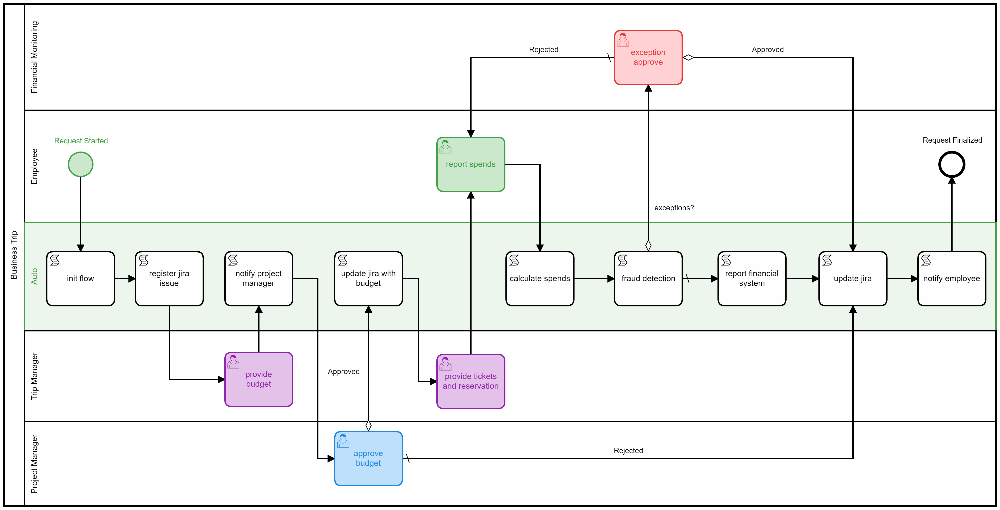

## The terraform module to create kubernetes cluster with camunda+grafana

Follow the instructions below to configure and deploy the business process at AWS cloud

* deployment screencast: https://youtu.be/TVhM6UuwNdM
* camunda demo screencast: https://youtu.be/qJo_3Y1Qy74

## pre-deployment configuration for the camunda process

there are additional parameters defined in camunda component config required by this demo: [00-camunda.yaml](./persistent/bpm/conf/00-camunda.yaml)

we aro going to send emails, manipulate data in the database, and integrate with jira in this demo.

that's why you have to provide the following parameters in corresponting files:

1. register trial jira-core atlassian cloud account
2. provide a credentials to register jira issue in the variable `tf_jira_auth` in `1.auto.tfvars` file
   follow the instructions to get api token: https://confluence.atlassian.com/cloud/api-tokens-938839638.html
2. create the jira project (TRIP) and store `jira.url`, `jira.trip.projectId`, and `jira.trip.issueType` into [00-camunda.yaml](./persistent/bpm/conf/00-camunda.yaml).
   get IDs in `project settings`.
3. register gmail account to send mails and specify `tf_mail_user` and `tf_mail_pass` variables in `1.auto.tfvars`. alternatively you can change mail server parameters in 
   [00-camunda.yaml](./persistent/bpm/conf/00-camunda.yaml)

## create the infrastructure

follow the [instructions](./..) to create the required infrastructure in AWS cloud.

## camunda users

there are following predefined users:
```
admin / demo        camunda admin
employee / demo     busines trip requestor
tripman / demo      trip manager
prjman / demo		project manager
finmon / demo		financial monitoring
```

## camunda process scenario

Use 2 browsers. 1st for administration. 2nd to execute flow.

The HOST - is a random hostname generated after terraform execution.

### In 1st browser open following links:

#### kubernetes to show that all's running in kube cluster
https://HOST.amazonaws.com

> token: 1234567890-1234567890-1234567890-1234567890
> or the one you specified in 1.auto.tfvars file

#### grafana to show dashboard (there is just a sample dash named camunda)

https://HOST.amazonaws.com:3000

> admin / <password_from_1.auto.tfvars_tf_grafana_pass>

#### jira

https://JIRA_ACCOUNT.atlassian.net/projects/PROJECT_NAME/board

> where JIRA_ACCOUNT is a jira cloud account name 
> and PROJECT_NAME is a jira project name
> Going to this link requires your jira login and pass

in this demo: https://bpm-demo.atlassian.net/projects/TRIP/board
  
#### camunda-cockpit to see process definition and how many instances running at each process step
http://HOST.amazonaws.com:8080/

> admin / demo

NOTE: 
- on top-right click on "house image" and switch to camunda-admin page
- go through "employee" and "prjman" users and change email addresses to see mails for them
- go back to camunga-cockpit
- and each time if you are lost, click "process"->"business trip" to see map of the process and where your task (process instance) is located


### In 2nd browser open camunda and each time you have to re-login (so save user/pass). all passwords = "demo"

#### the process



#### process steps

http://HOST.amazonaws.com:8080/

01. click Tasklist
02. login as `employee`
03. on top-up corner click `Start process`
04. select `Business trip`, fill all fields (don't touch `Project Manager` because we have only one project manager), and click `Start`
    at this moment a new task appeared in jira - check it. in camunda process goes to trip manager to estimate trip budget.
05. re-login as `tripman`
06. in `group tasks` you should see `provide budget` task
07. click `claim` on the right top to assign task from group to current user
08. input editable fields ( price for tickets, accomodation, and dayly spends ) and click `complete`.
    at this moment project managet should receive an email.
09. re-login as `prjman`
10. check `My tasks`.
    if you change `Input Reject Reason ...` from `Approved` to something else - task goes to rejected and completes.
	if you keep `Approved` then task goes to the trip manager to make a reservation (tickets, accomodation).
	  at this moment jira task populated with budget info and changed to status `In Progress`.
11. re-login as `employee`
12. ! NOTE: this is the last user step because `fraud detection` always returns `OK`. 
      Completion affects jira, grafana, and email for employee.
    At this step there should be a table to input spends. but default forms does not provide this.
	so imagine we have a table with 4 columns: spends type, comment, amount, and link to scan-copy 
	    (here should be an integration with document management system)
	Input some values and complete the task.
13. (auto) (report financial system) updates some tables and affects grafana numers
14. (auto) (update jira) populates jira with approved spends and finishes the jira task 
15. (auto) (notify employee)


